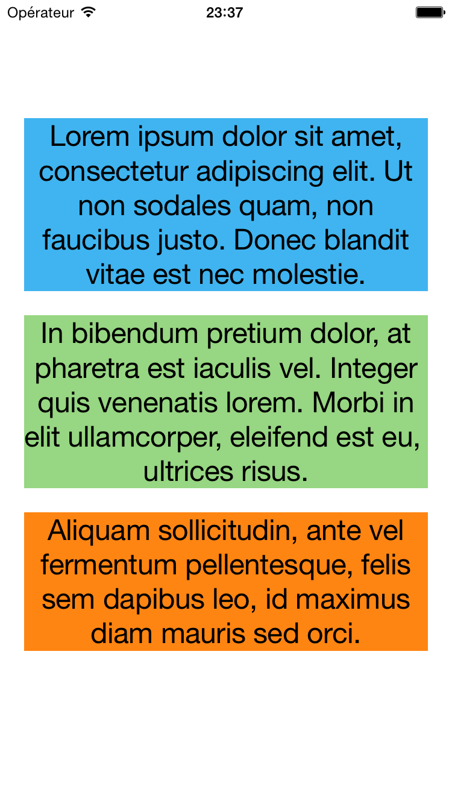
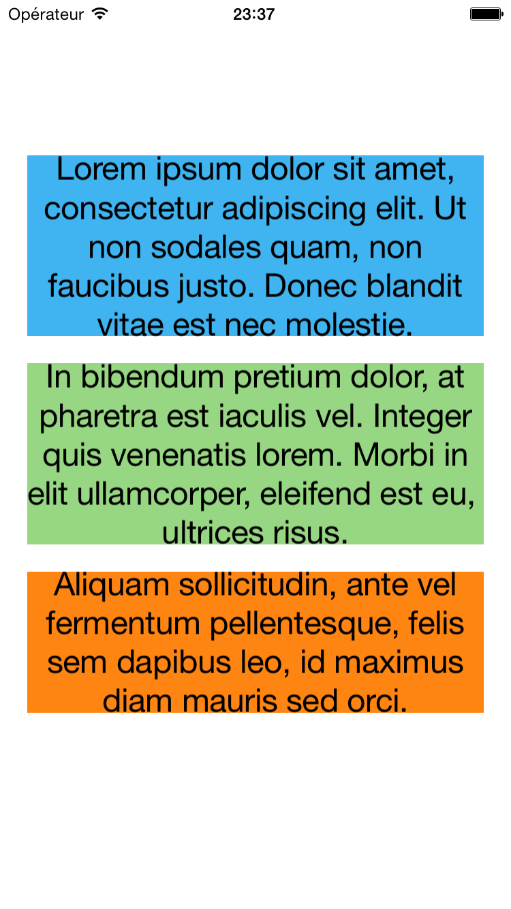
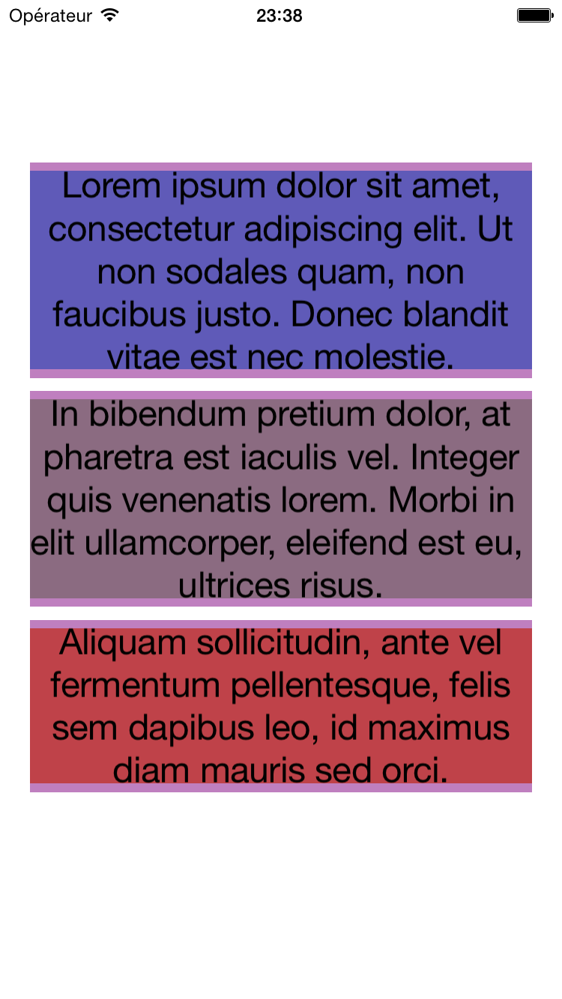

# SpacingLabel
Subclass of UILabel enabling better compliance with graphic charts in terms of space between text and other elements

## Introduction

Did you ever notice that a label vertically centered in a view is not perfectly in the middle of the view? That's because text is drawn relying on UIFont's information, especially the leading space and the descender of it. Removing this space from the top and the bottom of your label allows you to have more control on your layout; you can add a 20pts vertical constraints between two label and be sure that this space will be respected. This is why the ```SpacingLabel``` has been created.

<p align="center">
    
    Using standard UILabel components
</p>

<p align="center">
    
    Using SpacingLabel components
</p>

<p align="center">
    
    This highlight the drawing zone while the content size fits the text
</p>

## How does it work?

The ```SpacingLabel``` simply retrieve the font of the first line of text and the font of the last line of text to remove extra space on top of the first font cap height and the last font descender. 